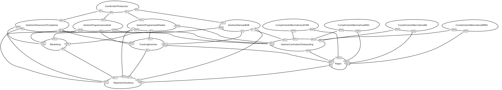
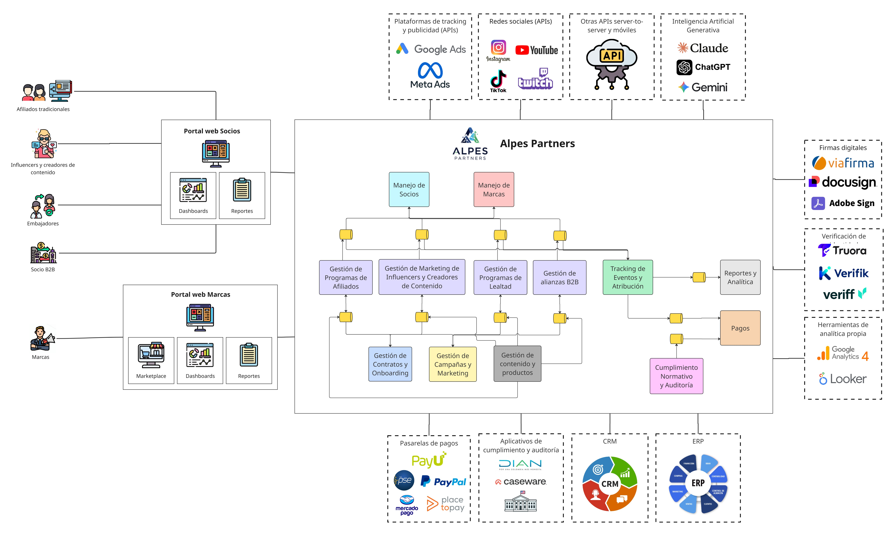
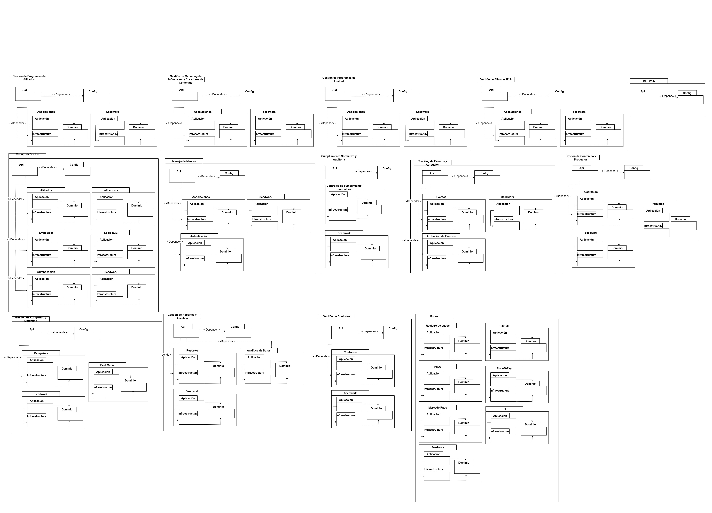
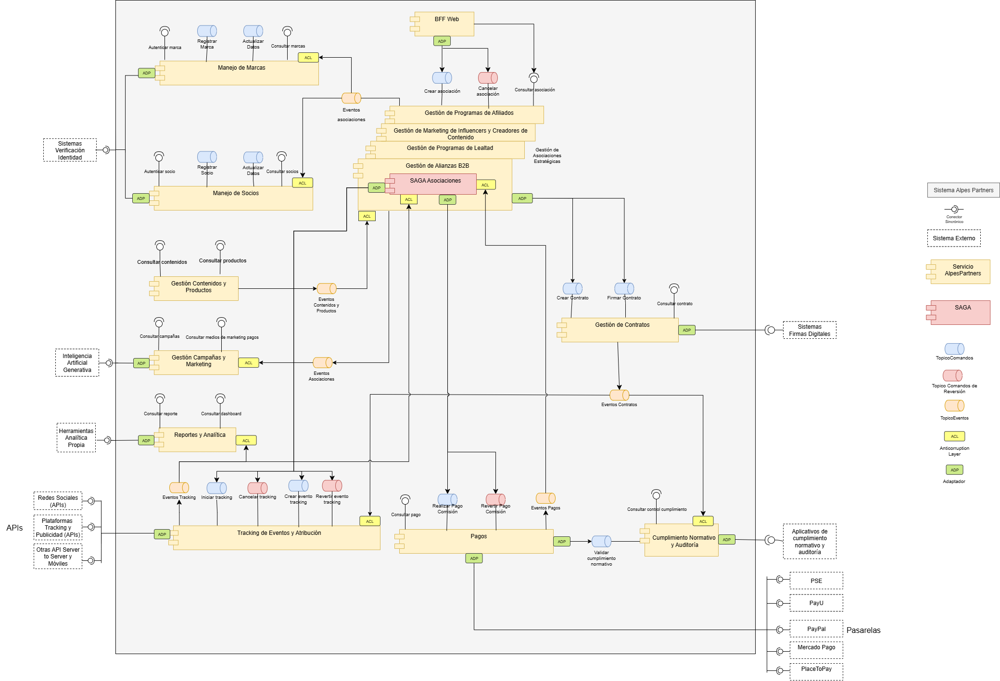
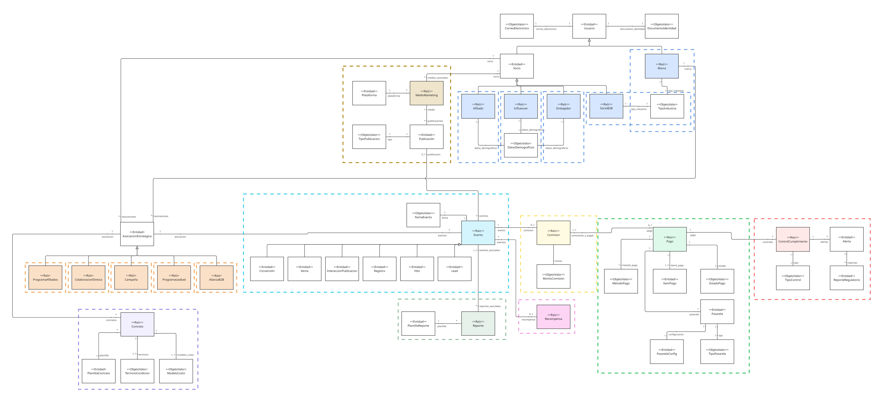

# Entrega 5

## Integrantes - Reactive Builders

| Nombre | Correo |
| :--- | :--- |
| Orlando Giovanny Solarte Delgado | o.solarte@uniandes.edu.co |
| Martín Flores Arango | r.floresa@uniandes.edu.co |
| Sara Sofía Cárdenas Rodríguez | ss.cardenas@uniandes.edu.co |
| Daniel Felipe Díaz Moreno | d.diazm@uniandes.edu.co |

## Video de la ejecución

Se encuentra en el directorio principal, con el nombre `video.mp4`

[Link video](https://github.com/ddi4z/MISW4406-Reactive-Builders-Entrega5/blob/main/video.mp4)

[Link video en Canvas](https://www.canva.com/design/DAGzn5Er4PQ/0rAWpR-zyRM7IYxHBqRTIg/watch?utm_content=DAGzn5Er4PQ&utm_campaign=designshare&utm_medium=link2&utm_source=uniquelinks&utlId=h50774f66e3)

## Repartición de trabajo

### Entrega 4

**Orlando Giovanny Solarte Delgado**

- Realizar una repartición y planificación detallada de las actividades
- Implementar microservicio de Asociaciones Estratégicas
- Hacer la integración del microservicio con Pulsar
- Grabar video de microservicio individual

**Martín Flores Arango**

- Implementar BFF
- Hacer documentación y Postman del microservicio
- Hacer justificaciones sobre las decisiones de diseño y arquitectura
- Grabar video de microservicio individual

**Sara Sofía Cárdenas Rodríguez**

- Implementar microservicio de Pagos
- Hacer cambios mayores al despliegue de GCP con máquinas virtuales
- Grabar video de microservicio individual
- Llenar wiki

**Daniel Felipe Díaz Moreno**

- Complementar microservicio de Eventos Tracking (Entrega 3)
- Configurar el bróker de Pulsar
- Crear archivo base de despliegue de GCP
- Grabar video de microservicio individual

### Entrega 5

**Orlando Giovanny Solarte Delgado**

- Realizar una repartición y planificación detallada de las actividades
- Colocar eventos y comandos compensación en el microservicio Asociaciones Estratégicas
- Desplegar los microservicios en la nube con comunicación con eventos
- Realizar y documentar la experimentación para el escenario de calidad de escalabilidad
- Hacer video del despliegue en la nube y el escenario de escalabilidad

**Martín Flores Arango**

- Implementar la Saga con orquestación
- Implementar el Saga Log
- Documentar la saga
- Preparar el Postman para el flujo de negocio
- Hacer video del funcionamiento de la Saga

**Sara Sofía Cárdenas Rodríguez**

- Hacer que el BFF se conecte a los comandos y eventos del microservicio de Asociaciones Estratégicas
- Realizar y documentar la experimentación para el escenario de calidad de modificabilidad, alterando Pagos y el BFF
- Realizar y documentar la experimentación para el escenario de calidad de disponibilidad
- Refinar mapa de contextos TO BE
- Refinar los puntos de vista de arquitectura de la entrega 2
- Hacer videos de los escenarios de modificabilidad y disponibilidad, mapa TO BE y puntos de vista de arquitectura

**Daniel Felipe Díaz Moreno**

- Colocar eventos y comandos en el microservicio Eventos Tracking
- Colocar eventos y comandos en el microservicio Pagos
- Realizar ajustes y cambios en el microservicio de Eventos Tracking
- Realizar ajustes y cambios en el microservicioa los microservicios de Pagos
- Modificar bróker de pulsar, Dockerfiles y docker-compose

## Estructura del proyecto

Cada microservicio se encuentra en la carpeta `src`. En el repositorio principal se encuentra el `docker-compose.yml` para pruebas locales y el `infra.yaml` para despliegue. También se presentan los diferentes `X-requirements.txt` y Dockerfiles

## Arquitectura

### Mapa de contexto TO BE

En la carpeta `docs/` se puede encontrar la imagen `to_be.png`

Los archivos de generación están en la misma carpeta, bajo los nombres `contextosToBe.cml` y `subdominios.cml`

Para poder ejecutarlos, diríjase al repositorio de la entrega 1 actualizado. Este es el [link](https://github.com/ddi4z/MISW4406-Reactive-Builders-Entrega1/tree/main)

### Puntos de vista de arquitectura

En la carpeta `docs/` se puede encontrar la entrega 2 corregida, bajo el nombre `Entrega_2.pdf`

Allí se incluyen los requerimientos de calidad junto a las vistas de contexto, funcional (módulo y C&C) y dominio, con su respectivos puntos de sensibilidad y otras consideraciones

En dicha carpeta también se encuentran las imágenes para cada uno de los puntos de vista:

#### Contexto

#### Módulo

#### C&C

#### Dominio

### Escenarios de calidad relacionados

**Escalabilidad:** Crecimiento de clics ante jornada de descuentos

**Modificabilidad:** Agregar un nuevo caso de uso sin modificar los existentes

**Disponibilidad:** Caída de un servicio y el sistema sigue operando ante el cliente

## Pasos de ejecución

Cada microservicio ubicado en la carpeta `src` tiene sus propios pasos de ejecución en un README.md

## Ejecución con GCP

