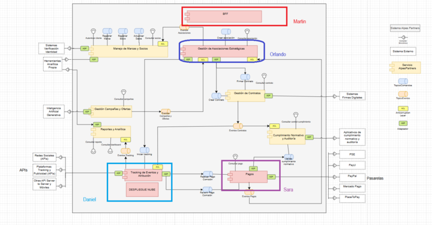

# Entrega 4 - Implementación

## 👥 Integrantes - Reactive Builders

| Nombre | Correo |
| :--- | :--- |
| Orlando Giovanny Solarte Delgado | o.solarte@uniandes.edu.co |
| Martín Flores Arango | r.floresa@uniandes.edu.co |
| Sara Sofía Cárdenas Rodríguez | ss.cardenas@uniandes.edu.co |
| Daniel Felipe Díaz Moreno | d.diazm@uniandes.edu.co |

## Estructura del proyecto

Cada microservicio se encuentra en la carpeta `src`. En el repositorio principal se encuentra el `docker-compose.yml` para pruebas locales y el `infra.yaml` para despliegue

## Repartición de trabajo

| Nombre | Contribución |
| :--- | :--- |
| Orlando Giovanny Solarte Delgado | Microservicio de Asociaciones estratégicas |
| Martín Flores Arango | BFF |
| Sara Sofía Cárdenas Rodríguez | Microservicio de Pagos y Despliegue GCP |
| Daniel Felipe Díaz Moreno | Complementar Microservicio de Eventos y Atribución (Entrega 3), Configuración de Pulsar y Despliegue GCP  |

## Arquitectura





## Escenarios de calidad relacionados

**Escalabilidad:** Escenario de calidad: Crecimiento de clics ante jornada de descuentos
**Modificabilidad:** Agregar un nuevo caso de uso sin modificarlos existentes
**Disponibilidad:** Caída de un servicio y el sistema sigue operando ante el cliente

## Aplicación de DDD y EDA

Explicada en los videos

## Pasos de ejecución

Cada microservicio ubicado en la carpeta `src` tiene sus propios pasos de ejecución en un README.md

## Ejecución con GCP

### 1. Configurar el proyecto
Primero, selecciona el proyecto de Google Cloud con el que vas a trabajar:

```bash
gcloud config set project reactive-builders
```

### 2. Habilitar las APIs necesarias

Deployment Manager y Compute Engine requieren que ciertas APIs estén habilitadas:

```bash
gcloud services enable compute.googleapis.com deploymentmanager.googleapis.com
```

### 3. Editar el archivo de configuración YAML

Antes de crear un deployment, asegúrate de definir tu infraestructura en un archivo YAML:

```bash
nano infra.yaml
```

En este archivo defines instancias de Compute Engine, discos, redes, y cualquier otro recurso que necesites.

Para esto, puedes copiar y pegar el contenido del archivo del mismo nombre.

### 4. Crear un deployment

Una vez tengas tu archivo YAML listo, puedes crear el deployment:

```bash
gcloud deployment-manager deployments create alpes-infra --config infra.yaml
```

Esto creará todas las instancias y recursos definidos en `infra.yaml`.

### 5. Actualizar un deployment

Si haces cambios en `infra.yaml`, puedes actualizar tu deployment existente:

```bash
gcloud deployment-manager deployments update alpes-infra --config infra.yaml
```

### 6. Revisar logs de arranque de instancias

Para depurar o verificar que tus instancias levantaron correctamente, puedes revisar el output del puerto serial:

```bash
gcloud compute instances get-serial-port-output postgres-pagos --zone=us-central1-c | grep -i "startup"
gcloud compute instances get-serial-port-output postgres-eventos --zone=us-central1-b | grep -i "startup"
gcloud compute instances get-serial-port-output postgres-asociaciones --zone=us-central1-f | grep -i "startup"
gcloud compute instances get-serial-port-output pagos-app --zone=us-central1-c | grep -i "startup"
gcloud compute instances get-serial-port-output eventos-app --zone=us-central1-b | grep -i "startup"
gcloud compute instances get-serial-port-output asociaciones-app --zone=us-central1-f | grep -i "startup"
gcloud compute instances get-serial-port-output bff-app --zone=us-central1-c | grep -i "startup"
```

> Esto permite filtrar los mensajes de inicio (`startup`) generados por los scripts de inicialización de cada VM.

### 7. Eliminar un deployment

Cuando ya no necesites los recursos, puedes eliminarlos de forma segura:

```bash
gcloud deployment-manager deployments delete alpes-infra --quiet
```

El flag `--quiet` evita confirmaciones interactivas.

## Video de la ejecución

https://www.canva.com/design/DAGzAbrq3tQ/_sg78z7WpYrdPNSeRpp21g/edit?utm_content=DAGzAbrq3tQ&utm_campaign=designshare&utm_medium=link2&utm_source=sharebutton

También se encuentra en el directorio principal, con el nombre `video.mp4`

[Link video](https://github.com/ddi4z/MISW4406-Reactive-Builders-Entrega3/blob/main/video.mp4)